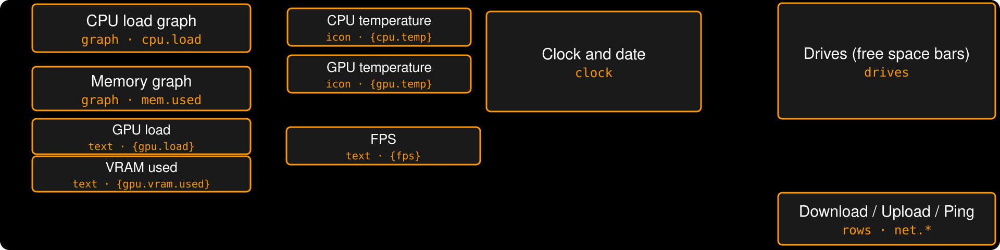
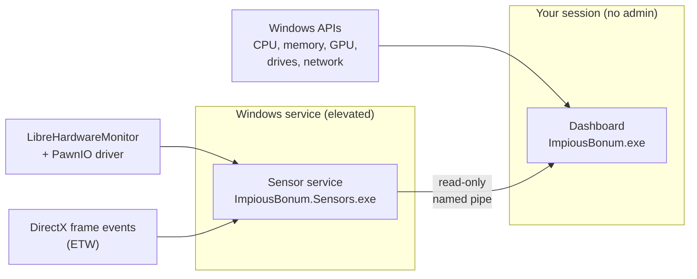

<p align="center">
  
</p>

<h1 align="center">Impious Bonum</h1>

<p align="center">
  <em>Dog-Latin for "wicked good".</em><br>
  A lightweight system dashboard for a spare screen, like the little touchscreen strip under your main monitor.<br>
  A native replacement for Rainmeter + HWiNFO setups, with no third-party monitoring software required.
</p>

<p align="center">
  <a href="https://github.com/ChaoDjinn/ImpiousBonum/releases/latest"></a>
  <a href="https://github.com/ChaoDjinn/ImpiousBonum/actions/workflows/ci.yml"></a>
  
  
  <a href="LICENSE"></a>
</p>

<!-- Screenshot of the real dashboard. Render one with: ImpiousBonum.exe --snapshot docs\images\dashboard.png
     then remove these comment markers:
<p align="center"></p>
-->

<p align="center">
  <a href="https://github.com/ChaoDjinn/ImpiousBonum/releases/latest/download/ImpiousBonum-win-Setup.exe"><b>Download the installer</b></a>
  ·
  <a href="#layout-editor">Layout editor</a>
  ·
  <a href="docs/widgets.md">Widget reference</a>
</p>

## Highlights

- **Made for a spare screen.** Pick a monitor; the dashboard fills it and comes back to the same place after reboots or display changes. It's hidden from the taskbar and Alt+Tab, and tapping it never steals focus.
- **The numbers you'd run HWiNFO for, built in.** CPU, memory, GPU, drives and network out of the box. The optional sensor service adds temperatures, fans, clocks, power and per-app FPS, about 280 metrics on a typical PC.
- **Edit it visually, or by hand.** A layout editor with live preview, drag and resize, a searchable metric picker and touch editing on the dashboard itself. Underneath it's one JSON file that applies live as you save it.
- **Tiny footprint.** About 50 MB of private memory and well under 0.1% CPU when idle; the sensor service adds about 20 MB.
- **Installs and updates itself.** A per-user installer with no admin prompt, and small background updates from GitHub Releases.

## The default layout

Out of the box it fills a 1920×480 screen like this (any size works: the canvas scales to fit, and you can change the design size):

<p align="center"></p>

Every box is a widget you can move, resize, restyle or replace. Six widget types are available: `text`, `graph` (line or area history with a header), `icon` (accent icon + value), `clock`, `drives` and `rows`. Every setting, its default and its range is in the [widget reference](docs/widgets.md).

## What it shows

| Metric ids | Source |
|---|---|
| `cpu.load`, `cpu.threads` | `GetSystemTimes` |
| `mem.used`, `mem.total`, `mem.available`, `mem.load` | `GlobalMemoryStatusEx` |
| `gpu.name`, `gpu.load`, `gpu.vram.used`, `gpu.vram.total` | GPU performance counters + DXGI (same numbers as Task Manager) |
| `disk.<L>.free/used/total/usedPct/label` | `DriveInfo`, follows drives as they come and go |
| `net.down`, `net.up` | Adapters with a default gateway |
| `net.ping` | ICMP to `1.1.1.1` (configurable) |
| `cpu.temp`, `cpu.power`, `gpu.temp`, `gpu.hotspot`, `gpu.power`, `gpu.fan` | Sensor service (below) |
| `fps`, `fps.app` | Sensor service counts DirectX frames per app (like PresentMon/HWiNFO); the tray's *FPS from* picks the foreground app or the top app on a chosen monitor |
| `hw/...` (every sensor LibreHardwareMonitor finds: clocks, voltages, fans, per-core loads, …) | Sensor service. Run `ImpiousBonum.Sensors.exe list` to see the ids on your machine |
| `sensors.status` | Text describing the sensor service connection |

## Installing

Download [`ImpiousBonum-win-Setup.exe`](https://github.com/ChaoDjinn/ImpiousBonum/releases/latest/download/ImpiousBonum-win-Setup.exe) from the [latest release](https://github.com/ChaoDjinn/ImpiousBonum/releases/latest) and run it.

- It installs for your user only (no admin prompt) into `%LocalAppData%\ImpiousBonum`, adds Start menu and desktop shortcuts, and installs the .NET 10 Desktop Runtime first if you don't have it.
- On first run it picks your smallest secondary monitor. Use the tray icon to move it to another display, edit the layout, or turn on *Start with Windows*.
- The app checks GitHub for updates, downloads them in the background, and offers *Restart to update* in the tray menu. Updates are small deltas.
- After an update, if the sensor service is from an older version the tray says so; *Sensors → Update sensor service…* brings it up to date.
- Uninstall from Windows Settings → Apps. It removes start-with-Windows and offers to remove the sensor service (one UAC prompt). Your layout and settings in `%AppData%\ImpiousBonum` are kept.
- The installer isn't code-signed yet, so Windows SmartScreen may warn the first time: choose *More info → Run anyway*.

Settings and layout live in `%AppData%\ImpiousBonum`:

- `layout.json`: canvas size, theme and widgets. Saved changes apply immediately.
- `settings.json`: which monitor, ping host, `hardwareRendering` (off by default to save memory).

## Sensor service (temperatures, fans, power, FPS)

Reading CPU temperatures needs admin rights and a kernel driver, so it lives in a separate process: `sensors\ImpiousBonum.Sensors.exe`, built on [LibreHardwareMonitor](https://github.com/LibreHardwareMonitor/LibreHardwareMonitor). The dashboard itself stays unelevated and receives readings over a read-only named pipe.



- **Install:** tray icon → *Sensors* → *Install sensor service…* (one UAC prompt). The host is copied to `Program Files\Impious Bonum\Sensors` and registered as an auto-start service, so there are no prompts at logon.
- **CPU temperatures** also need the signed [PawnIO](https://pawnio.eu) driver (`winget install namazso.PawnIO`). HWiNFO and FanControl install it too. GPU sensors work without it.
- The service only reads hardware while a dashboard is connected. Its log is in `%ProgramData%\ImpiousBonum\sensors.log`.
- For development: `ImpiousBonum.Sensors.exe run` serves from a console, and `list` prints every sensor. Both work unelevated with fewer sensors.

## Layout editor

Double-click the tray icon (or tray → *Edit layout…*, or right-click / press and hold on the dashboard) to open the editor on your main screen:

- **Preview:** click a widget to select it, drag to move, drag the handles to resize. Moves snap to a grid (toolbar); hold Alt to place freely. Arrow keys nudge, Shift+arrows by 10.
- **Metrics:** template and metric fields have a `{…}` button that opens a searchable list of every metric (about 280 on a typical PC, including every raw sensor) with live values. Pick one and choose how to show it (e.g. `18.7 GB`, `19,138 MB` or just `18.7`) and it's inserted at the cursor. Under each field a live preview shows what it renders now and flags unknown metric ids.
- **Properties:** every setting of the selected widget, with the right control for each (numbers, colours with a picker, fonts, drop-downs, lists) and a reset-to-default button. Click empty canvas or press Esc for canvas size and theme.
- **Widgets:** add, duplicate (Ctrl+D), delete, and bring forward / send back.
- **On the dashboard itself:** while the editor is open, the dashboard shows outlines and finger-sized handles. Tap a widget to select it, drag to move, drag a handle to resize; the editor follows along (and vice versa), with the same snapping and undo.
- The real dashboard shows your changes live while you edit. **Save** (Ctrl+S) writes `layout.json`; closing without saving puts the dashboard back as it was. Undo/redo with Ctrl+Z / Ctrl+Y.

<!-- Editor screenshot (Win+Shift+S): save as docs/images/editor.png, then remove these comment markers:
<p align="center"></p>
-->

## Editing layout.json by hand

The canvas has a design size (default 1920×480) and scales to fit the window. Each widget has `type`, `x`, `y`, `width`, `height` plus its own settings. Text uses templates:

```json
{ "type": "text", "x": 58, "y": 296, "width": 427, "height": 76, "fontSize": 64, "text": "{gpu.vram.used:N0 MB}" }
```

`{id}` formats automatically (`18.7 GB`, `11.8 %`, `79.7 KB/s`). After a colon you can add a number format (`0.0`, `N0`), force a byte unit (`MB`, `GB`, …) or write `nounit`. Readings that aren't available show as `—`.

If `layout.json` has a typo or an out-of-range value, the tray shows a notification saying what and where, e.g. *unknown setting 'fontsize' (did you mean 'fontSize'?)*.

To use a font you don't want to install, point the theme at the file: `"fontFile": "C:\\Fonts\\SomeFont-Light.otf"`.

## Command line

| Option | |
|---|---|
| `--data-dir <dir>` | Use a different settings folder |
| `--snapshot <file.png>` | Render the layout with live data to a PNG and exit |
| `--warmup <seconds>` | Sampling time before a snapshot (default 3) |
| `--widget-docs <file>` | Regenerate the widget reference from the widget descriptors |

## Development

### Running from source

Requires the .NET 10 SDK on Windows 10/11.

```bash
dotnet run --project src/ImpiousBonum.App -c Release
```

Tests: `dotnet test ImpiousBonum.slnx -c Release` (CI runs the same on every push and pull request).

### Making a release

Push a version tag and GitHub Actions builds, tests, packs and publishes it:

```bash
git tag v0.2.0
```

```bash
git push origin v0.2.0
```

To build the installer locally instead: `pwsh build/publish.ps1 -Version 0.2.0` (output in `artifacts/releases`).

### Layout of the code

```
src/ImpiousBonum.Core    metric store, formatting/templates, providers, sampler (no UI)
src/ImpiousBonum.App     WPF dashboard, widgets, editor, tray, monitor placement, updates
src/ImpiousBonum.Sensors elevated sensor service (LibreHardwareMonitor, ETW frame counting) serving the named pipe
tests/                   unit tests for the core and the app (widgets, layout validation, editor)
docs/widgets.md          widget reference, generated from the widget descriptors
build/                   installer build (publish.ps1) and icon generator
```

## Roadmap

- [x] Borderless dashboard on a chosen monitor, remembered placement, the default layout
- [x] Sensor host: elevated service (LibreHardwareMonitorLib) for temperatures, fans, clocks and power, over a named pipe
- [x] Layout editor: live preview, drag/resize, generated properties, theme, undo/redo
- [x] Metric picker: browse and search every metric with live values, insert into templates
- [x] Touch edit mode on the dashboard itself, synced with the editor
- [x] Installer and automatic updates (Velopack, GitHub Releases)
- [ ] Code signing
- [ ] Vulkan/OpenGL frame counting
- [ ] More widget types
- [ ] Themes

## License

[MIT](LICENSE)
