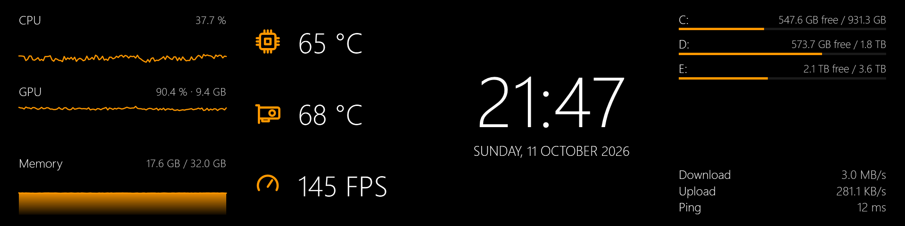
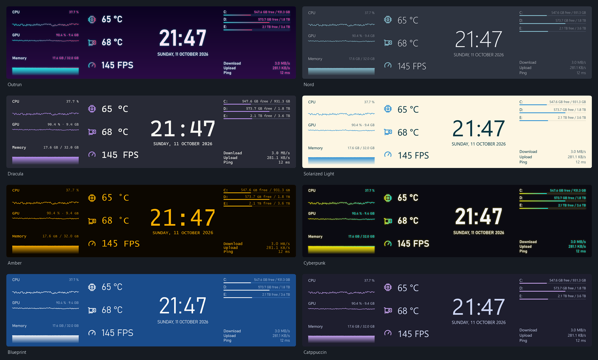
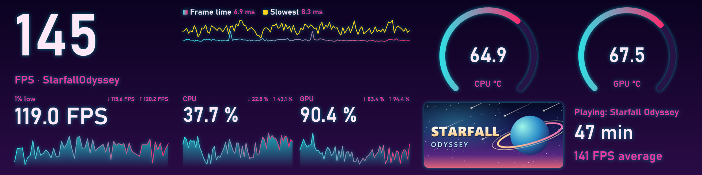
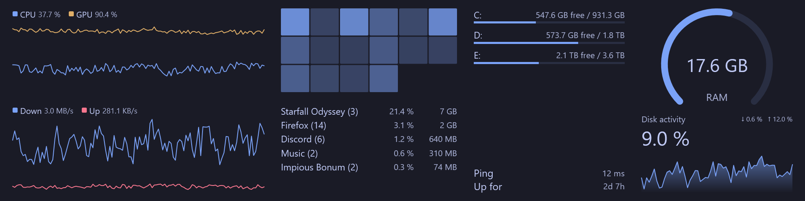
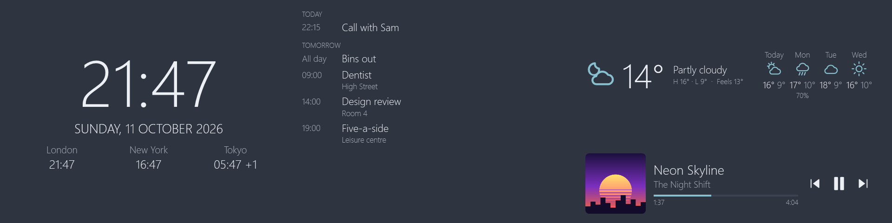
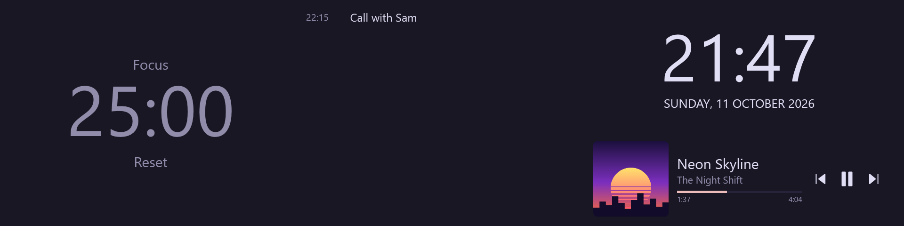
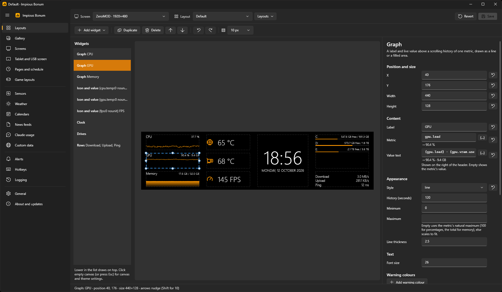

  

<h1 align="center">Impious Bonum</h1>

  <em>Dog-Latin for "wicked good".</em> 
  A lightweight system dashboard for a spare screen, like the little touchscreen strip under your main monitor. 
  A native replacement for Rainmeter + HWiNFO setups, with no third-party monitoring software required.

  
  
  
  
  

  <a href="https://github.com/ChaoDjinn/ImpiousBonum/releases/latest/download/ImpiousBonum-win-Setup.exe"><b>Download the installer</b></a>
  ·
  <a href="docs/guide.md">User guide</a>
  ·
  <a href="docs/widgets.md">Widget reference</a>
  ·
  <a href="gallery">Layout gallery</a>

## What it is

Impious Bonum turns a spare screen into a live view of your PC: CPU, GPU, memory, temperatures, FPS, drives and
network, alongside a clock, the weather, your calendar, what's playing and buttons to control it all. Lay it out how
you like in a visual editor, pick from 43 themes, and it runs quietly in the tray using about 50 MB of memory. No
spare screen? It works as a window too, on a tablet over Wi-Fi, or on a small USB screen.

## Features

**Your PC at a glance**
- CPU, memory, GPU, drives and network out of the box; add the optional sensor service for temperatures, fans, clocks, power and per-app FPS with frame times and 1% lows, about 280 metrics on a typical PC. [More](<docs/guide.md#what-it-shows>)
- Graphs, multi-line graphs, gauges, stat tiles, every CPU thread as a heatmap, drives, and the apps using the most CPU or memory. [More](<docs/guide.md#widgets-in-depth>)
- Session recaps when you finish a game: average, lowest and highest FPS, loads and temperatures. [More](<docs/guide.md#session-recaps>)
- Alerts when a reading stays out of bounds, and logging to CSV files for a spreadsheet. [More](<docs/guide.md#alerts>)

**Your day**
- Clocks with other time zones, timers and countdowns, the weather (no account needed), your calendar's agenda, and news headlines. [More](<docs/guide.md#world-clocks>)
- What's playing, with album art and controls, an audio visualiser, and buttons that open programs, send shortcuts or switch layouts. [More](<docs/guide.md#now-playing-and-buttons>)
- Your own data from any web address or command. [More](<docs/guide.md#custom-data>)

**Make it yours**
- A layout editor with live preview, drag and resize, and a searchable picker for every metric, plus touch editing on the dashboard itself. [More](<docs/guide.md#layout-editor>)
- 43 built-in themes, from clean to retro to neon, with gradients, glow, and picture, GIF or video backgrounds. [More](<docs/guide.md#layout-editor>)
- A gallery of shared layouts to try with your own readings and import, and export to share yours. [More](<docs/guide.md#layout-gallery>)

**It fits around you**
- Different layouts for different games, a schedule for times of day or dark mode, pages to swipe between, and global hotkeys. [More](<docs/guide.md#automatic-behaviour>)
- Dims or blacks out when you're away. [More](<docs/guide.md#dimming>)
- On a spare monitor (or several, each with its own layout), as a window, on a tablet or phone in its browser, or on a small 3.5" USB screen. [More](<docs/guide.md#more-screens>)
- About 50 MB of memory and well under 0.1% CPU when idle. A per-user installer with no admin prompt, and small automatic updates.

## A look for every desk

43 built-in themes, or make your own. Here's the default layout in eight of them:

Or start from a layout in the [gallery](gallery):

<table>
  <tr>
    <td width="50%"> <b>Gaming HUD</b>: frame rate, frame times and the session so far</td>
    <td width="50%"> <b>System Monitor</b>: loads, every CPU thread, the busiest apps</td>
  </tr>
  <tr>
    <td width="50%"> <b>Desk Companion</b>: world clocks, calendar, weather and music</td>
    <td width="50%"> <b>Focus</b>: a focus timer, your next event and your music</td>
  </tr>
</table>

Lay out your own in the editor, with a live preview, a searchable list of every reading and the same changes on the dashboard as you make them:

Screenshots use made-up readings (`build/screenshots.ps1`).

## Get started

1. Download and run [`ImpiousBonum-win-Setup.exe`](https://github.com/ChaoDjinn/ImpiousBonum/releases/latest/download/ImpiousBonum-win-Setup.exe) (Windows 10 or 11). It installs for your user only and adds the .NET runtime if needed. SmartScreen may warn the first time, since the installer isn't code-signed yet: choose *More info → Run anyway*.
2. The dashboard opens on your smallest secondary monitor, or as a window on your main screen if that's the only one. Right-click the tray icon to move it, make it a window, or turn on *Start with Windows*.
3. For temperatures and FPS, tray → *Sensors* → *Install sensor service…* (one admin prompt).
4. Double-click the tray icon to open the layout editor, or try a ready-made layout from tray → *Layout* → *Gallery…*.

The [user guide](<docs/guide.md>) covers everything else, and the [widget reference](docs/widgets.md) lists every widget's settings.

## Documentation

- [User guide](<docs/guide.md>): installing, the editor, every feature and how to set it up
- [Widget reference](docs/widgets.md): every widget and theme setting, its default and its range
- [Layout gallery](gallery): shared layouts, and how to add yours
- [Changelog](CHANGELOG.md): what's new in each release
- [Developing Impious Bonum](docs/development.md): building from source, releases, update signing and the code's layout
- [Contributing](CONTRIBUTING.md) and [security](SECURITY.md)

## Roadmap

- [x] Borderless dashboard on a chosen monitor, remembered placement, the default layout
- [x] Sensor host: elevated service (LibreHardwareMonitorLib) for temperatures, fans, clocks and power, over a named pipe
- [x] Layout editor: live preview, drag/resize, generated properties, theme, undo/redo
- [x] Metric picker: browse and search every metric with live values, insert into templates
- [x] Touch edit mode on the dashboard itself, synced with the editor
- [x] Installer and automatic updates (Velopack, GitHub Releases)
- [ ] Code signing
- [x] Vulkan/OpenGL frame counting
- [x] Tablet view: the dashboard in a browser over the local network
- [x] Bars, and Claude plan usage from Claude Code
- [x] More widget types: 22 so far
- [x] Themes: 43 built in, with gradients, glow and moving backgrounds
- [ ] Tried and tested on real USB screens, and support for the 5" and 8.8" models
- [x] Screenshots of the real dashboard and editor here and in the guide

## License

[MIT](LICENSE)
